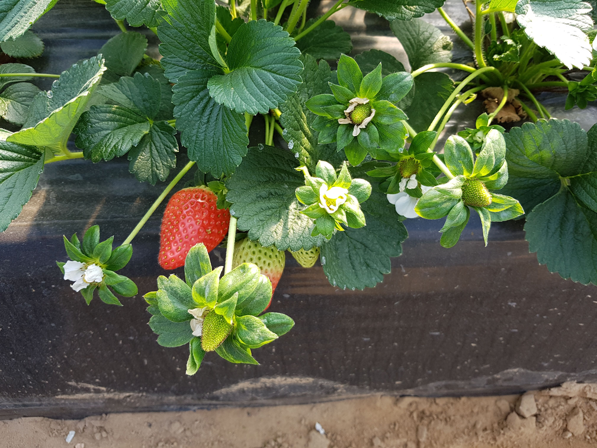
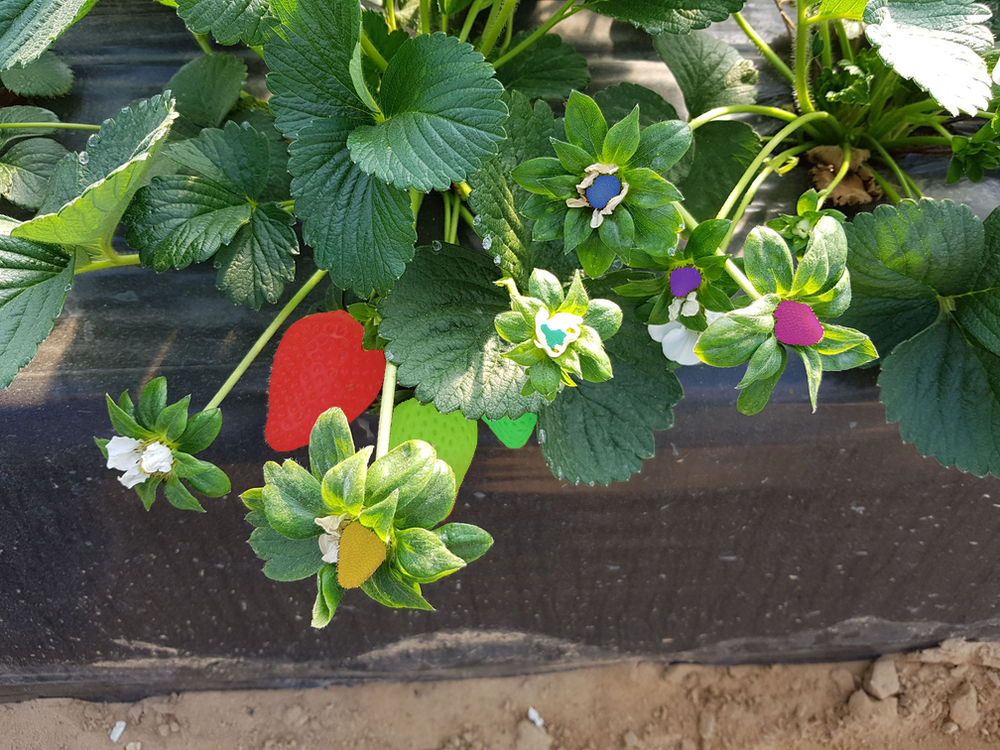
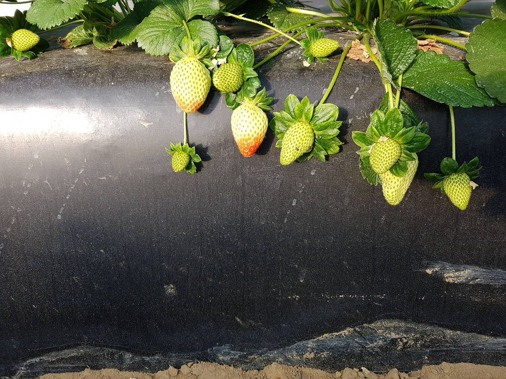
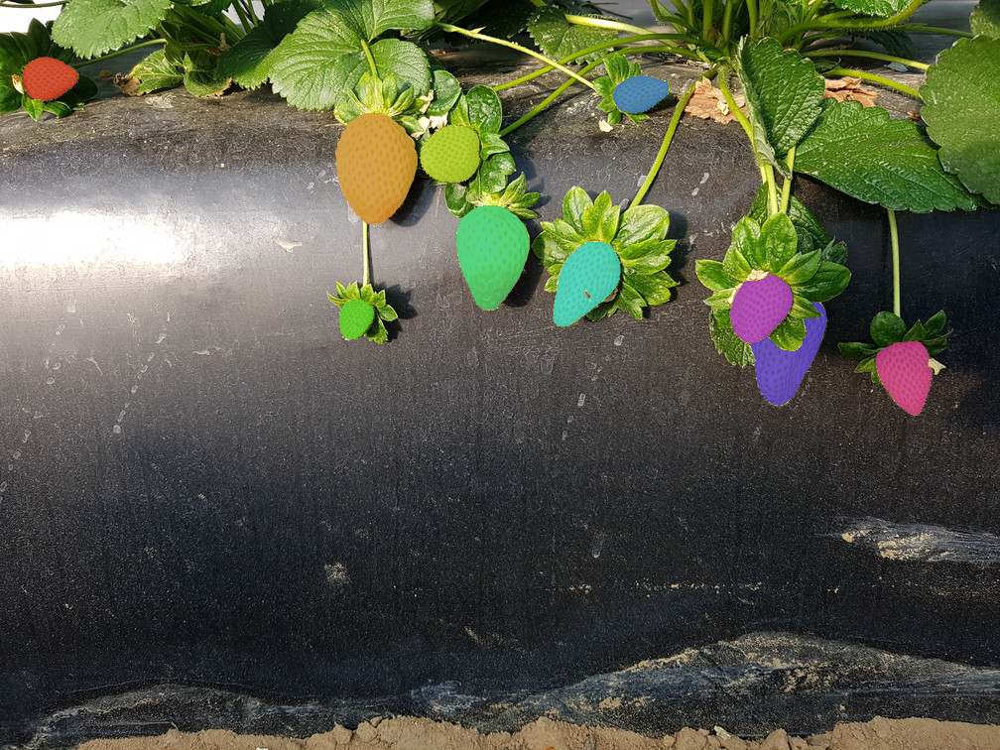
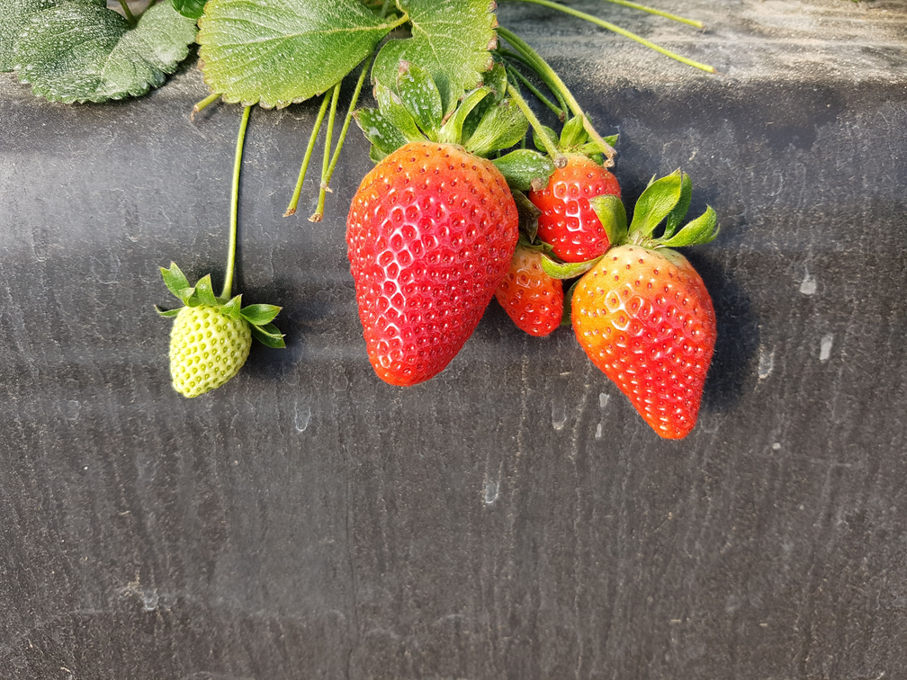
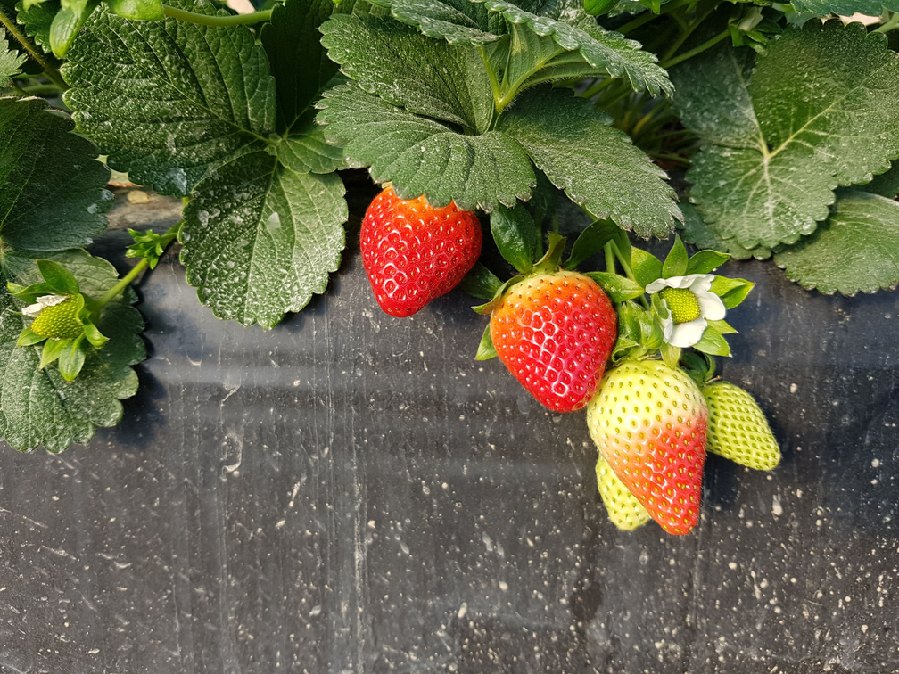
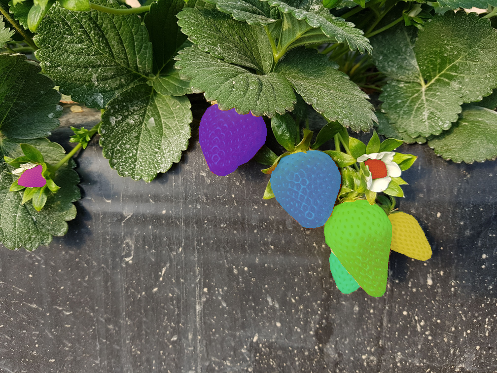
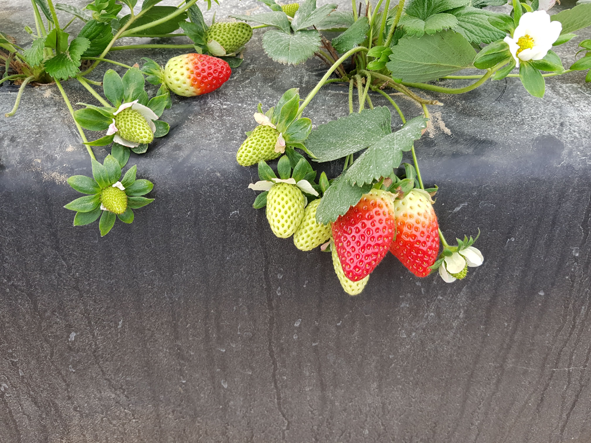
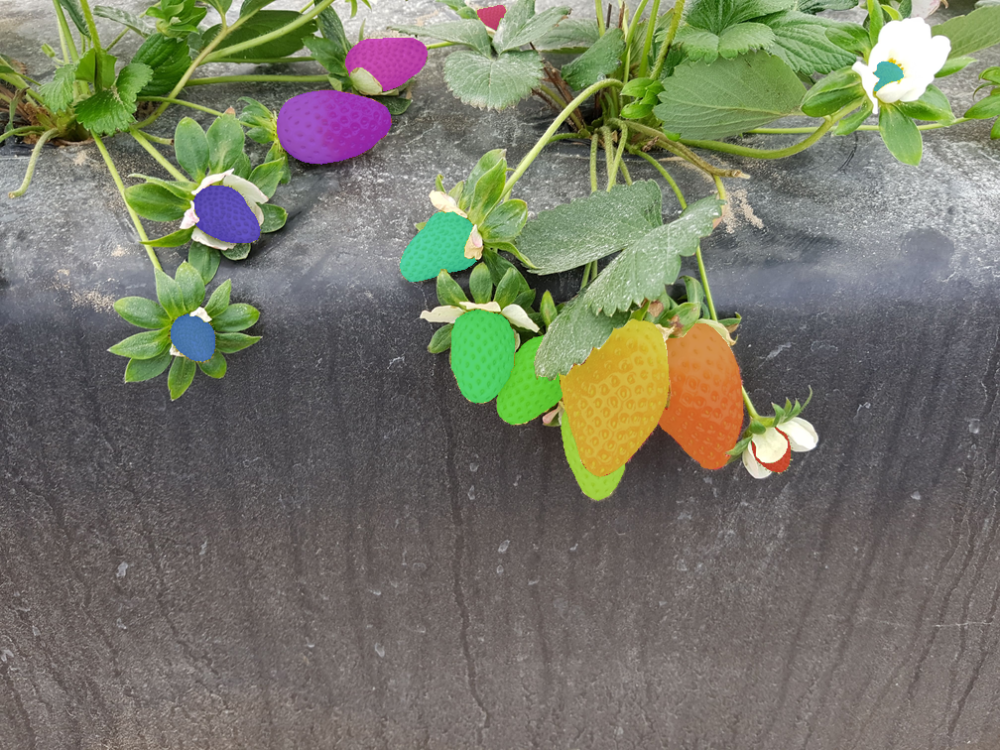

## Introduction
This page is the official website of the Strawberry Digital Images (StrawDI) data set, which contains 8000 images of strawberries, taken from 20 plantations, within an approximate area of 150 hectares, in the province of Huelva, Spain. The plantations were not changed in any way for the experiment and the images were taken from real production conditions during a full picking campaign (from mid-December 2018 to early May 2019).

The capture device used was a Samsung Galaxy S7 Edge smartphone attached to an extendable arm. In order to build a data set close to the target application, the images were taken under different conditions of brightness, at a distance of approximately 20 cm from the ridge, at about 35 +-10 cm height and an approximate angle of 25 +-10º. The images have a 4032x3024 resolution and are stored in a JPEG format.


<br>

### Contributors
- [Isaac Pérez*](mailto:isaac.perez@dci.uhu.es)
- [Diego Marin*](mailto:diego.marin@diesia.uhu.es)
- [Estefanía Cortés-Ancos*](estefania.cortes@diesia.uhu.es)
- [Manuel Emilio Gegúndez Arias*](gegundez@uhu.es)

_*Vision, Prediction, Optimisation and Control Systems Department, Science and Technology Research Centre, University of Huelva._

## StrawDI_Db1
From the total set of images that make up the StrawDI data set, 3100 images have been selected at random. For each of these images a ground truth labelled image has been manually generated containing the individual segmentation of all the strawberries appearing in the image.

To reduce the computational demands on the models, the images have been rescaled to 1008 x 756 and stored in PNG format. This set of images constitutes the __StrawDI_Db1__ database. This database is divided into train (2800 images), validation (100 images) and test (200 images) subsets.

### Labeling Policy
The image labelling process has been validated by three blind reviews of the data with four reviewers, thus guaranteeing the quality of the segmentations. The criterion followed in the labelling process consists of creating as accurate a mask as possible for each of the strawberries appearing in the image, including extreme cases such as strawberries that are almost imperceptible due to distance, occlusions, being at the edges of the image or still unripe.

The ground truth images are grayscale images that are the same size as the original rgb images and they are stored in PNG format. In the ground truth images, the value 0 is used for non-strawberry pixels, and strawberry pixels have the index of their strawberry, from 1 to the number of strawberries in the image.

### Examples
Below are examples of our high quality pixel annotations. Overlayed colors encode individual instances of strawberries. 

Original image             |  Original image with annotations
:-------------------------:|:-------------------------:
  |  
  |  
  |  
  |  
  |  


## Using the database
Please include the following acknowledgment…
```
Kindly provided by the StrawDI Team (see https://strawdi.github.io/).
```
…as well as a reference to the following paper:

```
@article{PEREZBORRERO2020105736,
title = "A fast and accurate deep learning method for strawberry instance segmentation",
journal = "Computers and Electronics in Agriculture",
volume = "178",
pages = "105736",
year = "2020",
issn = "0168-1699",
doi = "https://doi.org/10.1016/j.compag.2020.105736",
url = "http://www.sciencedirect.com/science/article/pii/S0168169920300624",
author = "Isaac Pérez-Borrero and Diego Marín-Santos and Manuel E. Gegúndez-Arias and Estefanía Cortés-Ancos"
}
```

To inform us of a publication using StrawDI_Db1, or to give us any other feedback, please contact [Isaac Pérez](mailto:isaac.perez@dci.uhu.es) or [Diego Marin](mailto:diego.marin@diesia.uhu.es).

## Download
To download the database: [StrawDI_Db1](https://drive.google.com/file/d/1elFB-q9dgPbfnleA7qIrTb96Qsli8PZl/view)

## License
This dataset is made freely available to academic and non-academic entities for non-commercial purposes such as academic research, teaching, scientific publications, or personal experimentation. Permission is granted to use the data given that you agree:

1. That the dataset comes “AS IS”, without express or implied warranty. Although every effort has been made to ensure accuracy, we (Isaac Perez-Borrero, Diego Marin, Manuel E. Gegundez-Arias and Estefanía Cortés-Ancos) do not accept any responsibility for errors or omissions.
2. That you include a reference to the StrawDI_Db1 Dataset in any work that makes use of the dataset. For research papers, cite our preferred publication as listed on [Using the database](#using-the-database) Section.
3. That you do not distribute this dataset or modified versions. It is permissible to distribute derivative works in as far as they are abstract representations of this dataset (such as models trained on it or additional annotations that do not directly include any of our data) and do not allow to recover the dataset or something similar in character.
4. That you may not use the dataset or any derivative work for commercial purposes as, for example, licensing or selling the data, or using the data with a purpose to procure a commercial gain.
5. That all rights not expressly granted to you are reserved by us (Isaac Perez-Borrero, Diego Marin, Manuel E. Gegundez-Arias and Estefanía Cortés-Ancos).
